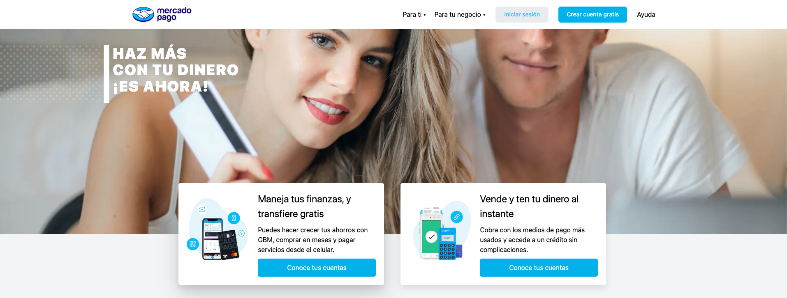

 <h1> Proyecto: Mercado Wallet <h1> 

 
 

Esta aplicación tiene como objetivo simplificar y agilizar tus transacciones financieras diarias. Permítanme presentarles las características clave en tres segmentos principales:
 
 
- Registro e Inicio de Sesión  
- Ingresos y Transferencias de Dinero 
- Dashboard y Seguimiento Financiero

En resumen, nuestra aplicación de billetera virtual en desarrollo simplifica tus transacciones financieras al ofrecer un registro fácil, ingresos de dinero sin problemas, transferencias instantáneas y un seguimiento financiero completo.

## Tecnologías usadas:

**Frontend**:  
 

 

 

**Backend**:  

**Diseño UX/UI:**  
  

## Equipo:

_Frontend_:  

- Abel Acuña  
  

- Alan Telo  
  
- Adriana Sánchez  
  

- Exequiel Gerez  
  

- Santiago Rueda  
  

_Backend_:  

- Cristian Illi  
  

- Juan Carlos Da Silva  
  

- Diego Guzman  
  

_UX/UI_:  

- Viarleth Aurora Martinez   

_Team leader_: 

- Cristian Sotelo  

## Vídeo:  

[Mercado Wallet](https://www.youtube.com/watch?v=5WcJRkv9Hyg)
`https://www.youtube.com/watch?v=5WcJRkv9Hyg`

## Deploy:  

[Mercado Wallet](https://mercado-wallet.vercel.app/)
`https://mercado-wallet.vercel.app/`

